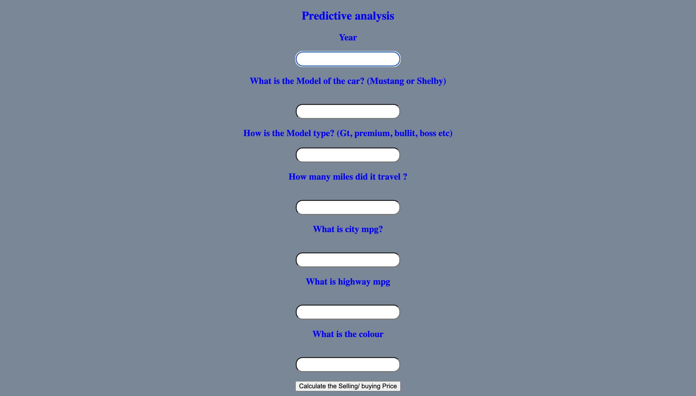

## The output the model can be seen below.
After running the model using flask, we just have to enter the inputs and click on Calculate the selling/ buying price to get our predictions

Next steps: Deploying this flask file in Heroku/ Streamlit
